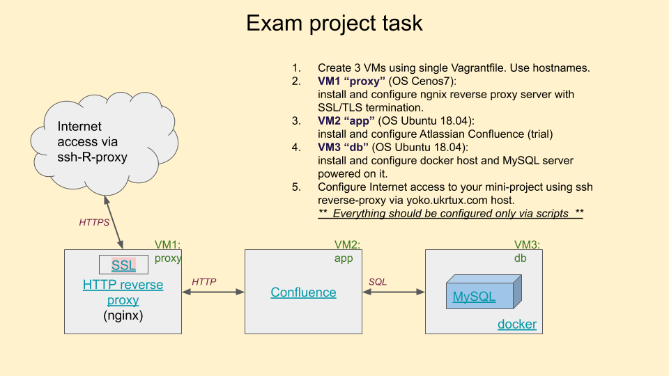

# IT-Step-task2109
Exam task for IT-STEP University (2019)

## Task description:
Setup Atlassian Confluence mini project based on 3VMs powered by VirtualBox&Vagrant and MySQL DB.

## Success criteria:
1. Each VM should be configured by single Vagrantfile
2. Use separate provision script for each VM.
3. Update your desktop /etc/hosts file to use VM names instead of IPs
4. Front-end nginx (_proxy_) server should be configured for HTTPS with HTTP redirection.
5. Network access to _db_ host should be enable only from _app_ VM 
6. Everything should start with single vagrant up.

## Task steps:
Create 3 VMs using single Vagrantfile. Use hostnames (/etc/hosts).
VM1 _proxy_ (OS Cenos7):
Install and configure ngnix reverse proxy server with SSL/TLS termination.
VM2 _app_ (OS Ubuntu 18.04):
[Download distro](http://yoko.ukrtux.com:8899/atlassian-confluence-7.1.0-x64.bin) and install and configure Atlassian Confluence (trial).
Use downloaded distro instead of direct download to save the time and network traffic.
VM3 _db_ (OS Ubuntu 18.04):
Install and configure docker host and MySQL server powered on it.
Configure Internet access to your mini-project using ssh reverse-proxy via yoko.ukrtux.com host.

Project scheme:
